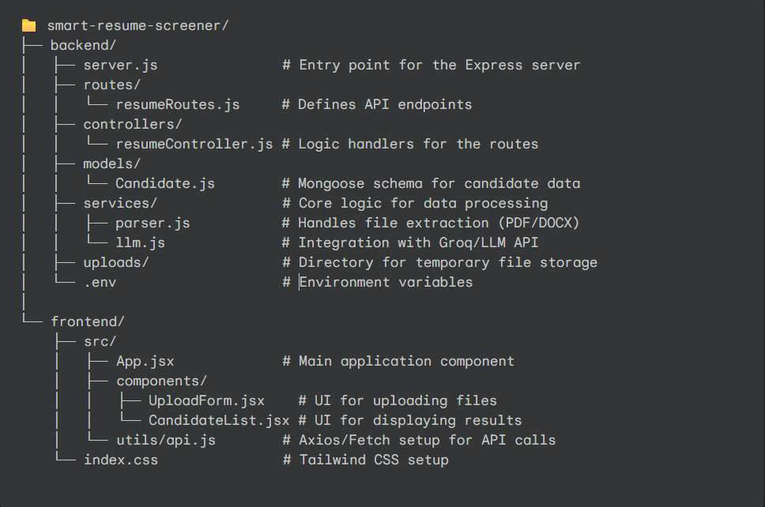

# 🧠 Smart Resume Screener

AI-powered Resume Parsing and Candidate Ranking System

# 📋 Objective

The Smart Resume Screener intelligently parses resumes, extracts structured information (skills, experience, education), and compares them against a provided job description.
Using Groq LLM, it computes a match score and generates justifications for each candidate, allowing recruiters to shortlist top candidates quickly.

# 🚀 Features

- ✅ Upload multiple resumes (PDF/Text)
- ✅ Parse and extract candidate details:
    - Name
    - Email
    - Skills
    - Education

- ✅ Compare each resume to a job description
- ✅ Use Groq LLM for semantic matching and scoring
- ✅ Display candidates ranked by match score
- ✅ Store results in MongoDB
- ✅ Modern React + Tailwind dashboard


# 🏗️ Tech Stack

**Client:** React.js, Tailwind CSS

**Server:** Node.js, Express.js

**Database:** MongoDB (Mongoose)

**LLM Integration:** Groq API

**Resume Parsing:** pdf-parse, text parsing

**File Upload:** Multer


# Architecture




# Environment Variables
## Backend
To run this project, you will need to add the following environment variables to your .env file

`PORT=5000`

`MONGO_URI=mongodb+srv://<your-username>:<your-password>@cluster.mongodb.net/resumeScreener`

`GROQ_API_KEY=your_groq_api_key_here`

`GROQ_MODEL=groq_model_name`

## Frontend

`VITE_BACKEND_URL=http://localhost:5000`

# Installation

## Clone the Repository

```bash 
git clone https://github.com/hrishikesh8904Smart-Resume-Screener.git
cd Smart-Resume-Screener

```
## Backend Setup

```bash
cd backend
npm install
npm run dev
```

## Frontend Setup

```bash
cd frontend
npm install
npm run dev
```

## Demo
1. **Upload multiple resumes (PDF/Text)**
2. **Paste a job description in the textarea**
3. **Click Analyze**
4. **Backend:**

    Extracts resume text

    Sends to Groq API for scoring

    Stores results in MongoDB
5. **Frontend:**
    Displays ranked candidates with score + justification


# LLM Prompting and Scoring Logic

```javascript
function buildPrompt(resumeText, jobDescription) {
  return `Compare the following resume and job description, and rate fit on a scale of 1–10.
Also provide a short justification (2–3 sentences).

Resume:
${resumeText}

Job Description:
${jobDescription}

Return JSON:
{
  "score": <number>,
  "justification": "<text>"
}`;
}
```
## Prompt Explaination
- The prompt instructs the model to:

    - Compare resume and job description

    - Assign a score (1–10)

    - Provide a short justification

- The LLM response is expected to be in strict JSON, e.g.:

```json
{
  "score": 8.5,
  "justification": "The candidate has strong backend skills and relevant Node.js experience but limited exposure to ML."
}
```
## Database Schema

```javascript
import mongoose from "mongoose";

const candidateSchema = new mongoose.Schema({
  name: String,
  email: String,
  skills: [String],
  education: String,
  experience: String,
  matchScore: Number,
  justification: String,
});

export default mongoose.model("Candidate", candidateSchema);
```
## API Call

- Endpoint: https://api.groq.com/openai/v1/chat/completions

- Model: openai/gpt-oss-20b

- Headers: Authorization (Bearer token from .env)

- Response timeout: 60s

- Format: JSON
# Author

**Hrishikesh Sane**

## 🔗 Links
[](https://hrishikesh-sane.vercel.app/)
[](https://www.linkedin.com/in/hrishikesh-sane-353254240/)


